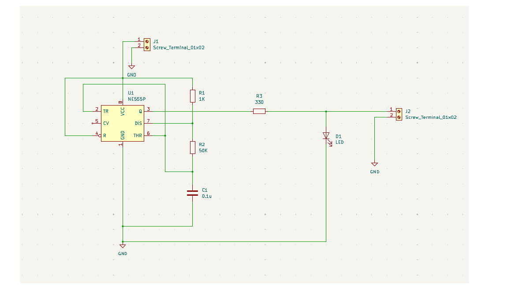

# Astable Multivibrator using 555 Timer

A blinking LED circuit built using the 555 timer IC in astable mode. This is my first PCB design, created using KiCad.

## How it works

The 555 timer is configured in astable mode, meaning it continuously switches between HIGH and LOW output with no external trigger. This causes the red LED to blink automatically at a fixed frequency determined by the resistor and capacitor values.

## Components

| Component | Value |
|-----------|-------|
| R1 | 1kΩ |
| R2 | 50kΩ |
| R3 | 330Ω (current limiting resistor for LED) |
| C1 | 0.1µF |
| LED | Red |
| IC | NE555 Timer |

## Supply Voltage

5V – 12V DC

## Schematic

## Tools Used

- KiCad (PCB design & schematic)

## Author

Made by [Fares Bazazaoa] — EEE Graduate
